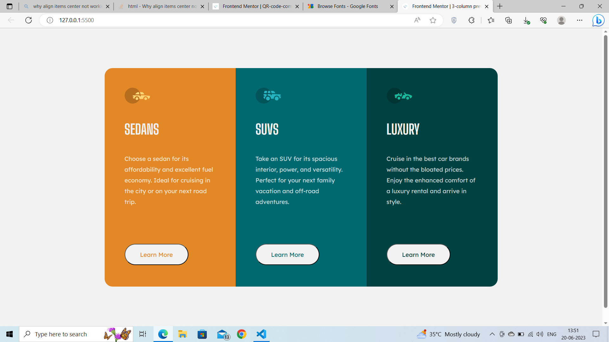

# Frontend Mentor - 3-column preview card component solution

This is a solution to the [3-column preview card component challenge on Frontend Mentor](https://www.frontendmentor.io/challenges/3column-preview-card-component-pH92eAR2-). Frontend Mentor challenges help you improve your coding skills by building realistic projects. 

## Table of contents

- [Overview](#overview)
  - [The challenge](#the-challenge)
  - [Screenshot](#screenshot)
  - [Links](#links)
- [My process](#my-process)
  - [Built with](#built-with)
  - [What I learned](#what-i-learned)
  - [Continued development](#continued-development)
  - [Useful resources](#useful-resources)
- [Author](#author)

## Overview

### The challenge

Users should be able to:

- View the optimal layout depending on their device's screen size

### Screenshot



### Links
- Live Site URL: [URL](https://your-live-site-url.com)

## My process

### Built with

- Semantic HTML5 markup
- CSS custom properties
- Flexbox
- Mobile-first workflow

### What I learned

I learned more about the display:flex and properties of flexbox and its role in responsiveness of website.
```css
main{
  display:flex;
    justify-content: center;
    flex-direction: row;
    flex-wrap: wrap;
    align-items: center;
}```

### Continued development

More practice on responsiveness is required.

### Useful resources

- [Flexbox Froggy](https://flexboxfroggy.com/) - Amazing game to learn important properties of CSS Flexbox.

## Author
- Frontend Mentor - [@HaardikMishra020](https://www.frontendmentor.io/profile/HaardikMishra020)
- LinkedIn - [@HaardikMishra](https://www.linkedin.com/in/haardik-mishra-399421225/)

